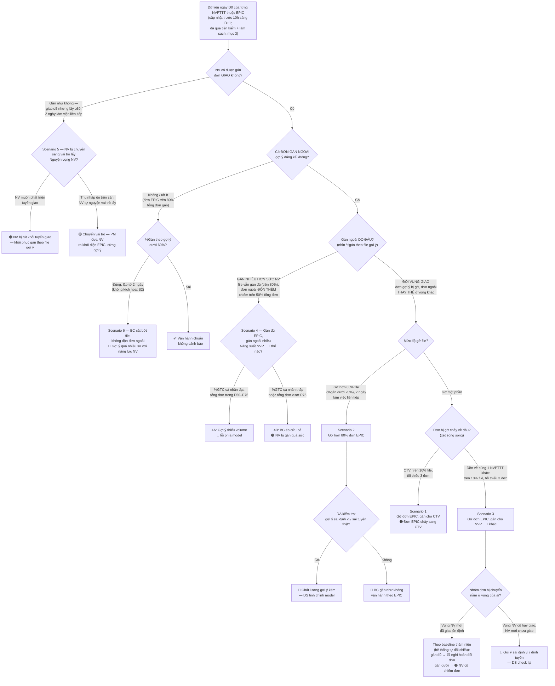

# Bộ Rule Cảnh Báo Gán Ngoài Gợi Ý EPIC (V1 — Nhận diện theo kịch bản hành vi + SOP xử lý)

**Mục đích:** Với mục tiêu scale up pilot lên **39 BC vùng HCM**, việc xây dựng hệ thống **tự động nhận diện và cảnh báo** hành vi gán đơn ngoài gợi ý bất thường là cần thiết để **Team BDA chủ động điều hành** — không thể theo dõi thủ công từng BC như giai đoạn pilot ít BC. Đồng thời giải quyết trực tiếp low light *"Số lượng đơn gán ngoài gợi ý vẫn cao hơn kỳ vọng"* (context.md mục 3.4).

**Nguyên tắc thiết kế (cập nhật 07/2026):** Dự án đã **loại bỏ cơ chế giải trình đơn gỡ gán** — hệ thống tự nhận diện bất thường từ dữ liệu, BC không phải nhập liệu.

**Cách tiếp cận:** Thay vì liệt kê rule rời rạc, tài liệu mô tả **4 kịch bản hành vi (user story)** theo cấu trúc **Ai → Làm gì → Hậu quả**, trong đó hậu quả quy chiếu trực tiếp về **NVPTTT mới** và **BC** — hai đối tượng chịu thiệt cuối cùng. Mỗi kịch bản gắn với: một rule nhận diện tự động (chỉ số + ngưỡng), một mức cảnh báo, và **SOP xử lý** quy định từng bên làm gì khi cảnh báo kích hoạt.

**Đối tượng theo dõi:** NVPTTT mới (<90 ngày) thuộc danh sách gợi ý EPIC tại các BC pilot. Đơn vị: **NVPTTT/ngày**.

---

## 1. Chỉ số — các chỉ số hệ thống tự lấy được

| Chỉ số | Cách tính | Nguồn dữ liệu (tự động) |
|---|---|---|
| Tổng số đơn trong file gợi ý | Số đơn trong file gợi ý của NVPTTT trong ngày | File gợi ý EPIC |
| Số đơn gợi ý có hàng thực tế tại BC | Tổng số đơn trong file gợi ý **trừ** các đơn không có bản ghi quét rã kiện trên WS trong ca | File gợi ý + log quét rã kiện WS (mục 4.5.A context.md) |
| Số đơn gán đúng gợi ý | Đơn gợi ý có hàng thực tế được gán cho đúng NVPTTT được gợi ý | Lastmile / AI-Portal tab "Thực tế" |
| **%Gán theo gợi ý** | Số đơn gán đúng gợi ý chia cho số đơn gợi ý có hàng thực tế tại BC | Tính từ các dòng trên |
| **Đơn gợi ý gán cho CTV** | Số đơn gợi ý (có hàng thực tế) bị gỡ và gán cho tài khoản **CTV / đối tác ngoài** | Log gán lastmile — loại nhân sự của người nhận đơn |
| **Đơn gợi ý gán cho NVPTTT khác — mức tập trung** | Số đơn gợi ý (có hàng thực tế) bị gán về **cùng một NVPTTT khác** nhiều nhất trong ngày | AI-Portal tab "Thực tế" + log gán lastmile (người thao tác, timestamp) |
| Số đơn ngoài gợi ý gán thêm | Đơn **không thuộc** file gợi ý nhưng được gán cho NVPTTT mới | Log gán lastmile đối chiếu file gợi ý |
| **%Đơn ngoài / tổng đơn gán** | Số đơn ngoài gợi ý chia cho tổng đơn được gán trong ngày (đơn gán đúng gợi ý cộng đơn ngoài) | Tính từ các dòng trên |
| **Tổng đơn gán trong ngày** | Toàn bộ đơn được gán cho NVPTTT trong ngày, cả trong và ngoài gợi ý | Log gán lastmile |
| **Đơn gán lấy trong ngày** | Số đơn lấy (pick) được gán cho NVPTTT trong ngày — toàn bộ nằm ngoài file gợi ý vì EPIC chỉ gợi ý đơn giao | Log gán lastmile |
| **%Đơn lấy / tổng đơn gán** | Số đơn lấy chia cho tổng đơn được gán trong ngày (giao cộng lấy) — chỉ số tham chiếu theo dõi mức kiêm nhiệm; rule Scenario 5 dùng điều kiện tuyệt đối (giao ≤5, lấy ≥30) | Tính từ các dòng trên |
| **%GTC cá nhân của NVPTTT** | Đơn giao thành công chia cho đơn được gán trong ngày | Lastmile |
| Baseline gán theo thâm niên *(giá trị tham chiếu)* | Khoảng **P50–P75** số đơn gán/ngày của NVPTTT cũ thành công (success_case) tại **cùng mốc thâm niên**. Hệ thống tự đối chiếu cho gate Scenario 4 và phân nhánh 🟡/🟠 của Scenario 3 | Lộ trình tăng trưởng đơn gán (mục 3.6 context.md) |

**Nguyên tắc chung:** Các rule chỉ tính trên số đơn gợi ý đã được hệ thống tự làm sạch (mục 3). Ngày có sự cố file (FALLBACK, mục 5.6 context.md) không tính vào chuỗi ngày liên tiếp.

**Quan hệ giữa các chỉ số:** %Gán theo gợi ý + %đơn gợi ý gán cho người khác (CTV hoặc NVPTTT khác) + %đơn gợi ý không ai gán = 100% (cùng mẫu số file gợi ý sau làm sạch). **Tỉ lệ tuân thủ hệ thống trên tổng đơn gán** = số đơn gán đúng gợi ý / tổng đơn gán trong ngày — đây là chỉ số hợp nhất dùng cho Scenario 4.

---

## 2. Actor, timeline & nguyên tắc xử lý chung

### Actor & vai trò

| Nhóm | Actor | Vai trò trong SOP |
|---|---|---|
| **Internal** | **PM** | Đầu mối điều phối: giám sát SLA, quyết định nâng/hạ mức cảnh báo và leo thang, truyền thông kết luận cho vùng, tổng hợp báo cáo tuân thủ hàng tuần |
| **Internal** | **DS** (Data Science) | Chủ model & pipeline: tinh chỉnh gợi ý (định vị, volume, ràng buộc dính tuyến NV cũ, lộ trình tăng trưởng đơn gán) — xử lý mọi cảnh báo 🔵 |
| **Internal** | **DA** (Data Analyst) | Chủ nút kiểm tra: verify gói chứng cứ, phân định **lỗi model ↔ lỗi vận hành BC** trước khi quy trách nhiệm; theo dõi chỉ số 7 ngày của mức 🟡; backtest ngưỡng |
| **Vùng** | **AM** | Đầu mối xử lý phía BC: đối chiếu chứng cứ, làm việc với NVXL/BC, xác nhận đã xử lý và cam kết kế hoạch điều chỉnh |
| **Vùng** | **NVXL** | Người thao tác gán tại BC: thực hiện điều chỉnh trực tiếp từ ca gán kế tiếp theo kết luận cảnh báo |
| **Vùng** | **HRBP** | Xử lý mức 🔴 và 🟣: xuống BC quan sát thực tế (mục 4.1.B context.md), xác nhận trạng thái nhân sự, ghi nhận retention, đề xuất cơ chế phạt/cảnh cáo (mục 4.2.C) |
| **Vùng** | **GĐV** | **Chỉ tag khi nghiêm trọng** (xem quy tắc bên dưới) — chỉ đạo BC, quyết định mức phạt/cảnh cáo cùng HRBP |

**Quy tắc tag GĐV — chỉ trong 3 trường hợp:**
1. Cảnh báo 🔴 **tái diễn lần 2 trong 7 ngày** tại cùng BC.
2. Cảnh báo **cấp BC** (≥50% NVPTTT thuộc EPIC tại BC cùng vi phạm mức 🟠 trở lên trong ngày).
3. Kích hoạt **cơ chế phạt/cảnh cáo** — HRBP trình, GĐV quyết.

Ngoài 3 trường hợp trên, mọi cảnh báo dừng ở AM/HRBP để không làm loãng kênh GĐV.

### Timeline chuẩn (áp cho mọi cảnh báo)

**Ràng buộc dữ liệu:** dữ liệu vận hành ngày D0 (log gán lastmile, quét rã kiện WS, chấm công/hành trình App Tài xế) chỉ được cập nhật đầy đủ **trước 10h sáng ngày D+1** → hệ thống chạy rule và phát cảnh báo lúc **10h sáng D+1**; mọi SLA tính từ mốc này. Hệ quả: file gợi ý ngày D+1 đã tạo **trước khi** có dữ liệu D0, nên mọi điều chỉnh model chỉ hiệu lực từ **file gợi ý ngày D+2**.

| Mốc | Việc | Actor |
|---|---|---|
| 10h sáng D+1 | Hệ thống chạy rule trên dữ liệu ngày D0, phát cảnh báo kèm gói chứng cứ (Gtalk + AI-Portal); cảnh báo 🔵 đẩy đồng thời kênh nội bộ | Hệ thống |
| Trước 12h D+1 | Hoàn tất nút kiểm tra (S2, S3) và verify chứng cứ (S1, S4A, S4B) — chốt nhánh lỗi model hay lỗi vận hành | DA |
| Trước 17h D+1 | Đóng cảnh báo 🟠: xác nhận đã xử lý + kế hoạch điều chỉnh từ ca gán kế tiếp | AM |
| Trong ngày D+1 | Xử lý cảnh báo 🔵: tinh chỉnh model/pipeline — hiệu lực từ **file gợi ý ngày D+2** | DS |
| Trước 10h D+2 (24h kể từ khi phát) | Đóng cảnh báo 🔴 / 🟣 | HRBP (+ AM) |
| Thứ 6 hàng tuần | Tổng hợp log cảnh báo — tuân thủ, tái diễn, tỷ lệ cảnh báo oan do lỗi gợi ý | PM + DA |

### Nguyên tắc xuyên suốt

1. **DA phân định trước, quy trách nhiệm sau:** mọi cảnh báo có nút kiểm tra (S2, S3) chỉ được kết luận trách nhiệm BC **sau khi** DA loại trừ lỗi gợi ý. Kết luận lỗi gợi ý → chuyển 🔵 cho DS, không tính vào chuỗi tái diễn của BC.
2. **Không yêu cầu BC giải trình:** cơ chế giải trình đã loại bỏ — NVXL/AM chỉ xác nhận xử lý và điều chỉnh hành vi; chứng cứ do hệ thống tự cung cấp.
3. **PM là người duy nhất quyết định nâng/hạ mức cảnh báo và tag GĐV** — tránh nhiều đầu mối leo thang khác nhau làm loãng kênh vùng.
4. **Đóng cảnh báo phải có xác nhận trên thread** (AM với 🟠, HRBP với 🔴/🟣, DS với 🔵) — cảnh báo quá SLA chưa đóng sẽ hiện trong báo cáo tuần của PM.
5. **Mọi điều chỉnh model của DS phát sinh từ cảnh báo** đều phản hồi lại thread gốc — khép vòng "vận hành báo → model sửa → vận hành thấy" (thay cơ chế giải trình thủ công, mục 4.6 context.md).

---

## 3. Tiền kiểm & tự động loại trừ (chạy trước 4 kịch bản)

Hai rule tiền kiểm chạy trước, độc lập với hành vi gán của BC:

| Rule tiền kiểm | Điều kiện | Hiện tượng & xử lý |
|---|---|---|
| Nghỉ ngang | Có **tín hiệu vắng mặt** (xem bảng loại trừ bên dưới: không phát sinh đơn gán giao — hoặc rất ít, ≤5 đơn — và không phát sinh đơn gán lấy) trong 3 ngày liên tiếp, không có nghỉ phép đã đăng ký | 🟣 **NV nghỉ ngang** — dừng gợi ý từ file ngày D+2, loại khỏi danh sách; HRBP xác nhận + ghi nhận retention |
| File gợi ý lệch hàng thực tế | Đơn có hàng thực tế dưới 80% tổng đơn file gợi ý | 🔵 **Lỗi dữ liệu/model** — cảnh báo ngược DS; ngày này không tính chuỗi liên tiếp; phần đơn đã làm sạch vẫn vào 4 kịch bản |

**SOP tiền kiểm 🟣 — NV nghỉ ngang:**

| Bước | SLA | Actor | Hành động |
|---|---|---|---|
| 1 | 10h sáng D+1 | Hệ thống | Phát cảnh báo Gtalk tag **AM + HRBP**; tự tạm dừng tạo gợi ý cho NV **từ file ngày D+2** (file D+1 đã tạo trước khi có dữ liệu) |
| 2 | Trong 24h | **AM** | Xác nhận thông tin từ BC: NV còn đi làm không, lý do vắng |
| 3 | Trong 24h | **HRBP** | Xác nhận trạng thái nhân sự: **nghỉ hẳn** → loại khỏi danh sách EPIC + ghi nhận retention (kèm dữ liệu lương/đơn những ngày cuối — đầu vào phân tích nguyên nhân nghỉ); **quay lại làm việc** → báo PM mở lại gợi ý |
| 4 | Sau xác nhận | **PM** | Cập nhật danh sách NV thuộc EPIC; DS mở lại gợi ý nếu NV quay lại |

GĐV: không tag.

**SOP tiền kiểm 🔵 — File gợi ý lệch hàng thực tế:**

| Bước | SLA | Actor | Hành động |
|---|---|---|---|
| 1 | 10h sáng D+1 | Hệ thống | Đẩy cảnh báo kênh nội bộ, kèm danh sách mã đơn không có bản ghi quét rã kiện; ngày này không tính chuỗi liên tiếp của các rule khác |
| 2 | Trong ngày D+1 | **DS** | Rà pipeline dữ liệu (đầu vào file gợi ý so với hàng về thực tế), điều chỉnh — hiệu lực từ file gợi ý ngày D+2 |
| 3 | Hàng tuần | **DA + PM** | Thống kê tần suất: kích hoạt ≥3 ngày trong 7 ngày → đưa vào review chất lượng model hàng tuần; cân nhắc đẩy sớm backlog 8.2 |

Phía vùng: không tag, không hành động.

Hệ thống đồng thời tự loại trừ các trường hợp hợp lệ từ tín hiệu khách quan, không cần BC khai báo:

| Trường hợp | Tín hiệu tự nhận diện | Xử lý |
|---|---|---|
| Đơn không có hàng vật lý | Đơn thuộc file gợi ý nhưng **không có bản ghi quét rã kiện** trên WS trong ca (mục 4.5.A context.md) | Loại khỏi mẫu số tính rule; đồng thời là đầu vào rule tiền kiểm "file lệch thực tế" |
| NVPTTT vắng mặt | Không chấm công / không bắt đầu chuyến đi trên App Tài xế trong ngày; **hoặc suy ra từ chính log gán khi dữ liệu chấm công thiếu/trễ:** trong ngày NV không phát sinh đơn gán giao (hoặc rất ít — ≤5 đơn, cả trong lẫn ngoài gợi ý) **và** không phát sinh đơn gán lấy (pick) — tín hiệu tăng cường: không có đơn GTC nào trong ngày | Loại toàn bộ record của NV-ngày đó khỏi 4 kịch bản (không tính %gán, không tính vào chuỗi vi phạm của BC); ngày này **vẫn tính** vào chuỗi 3 ngày của rule nghỉ ngang |
| Khu vực sự cố diện rộng (ngập, thi công) | %GTC hoặc tốc độ giao của **tất cả NVPTTT** (cả cũ lẫn mới) trong cùng cụm ô H3 giảm đồng loạt | Loại các đơn thuộc cụm đó khỏi mẫu số tính rule |
| NVPTTT khác tại BC vắng đột xuất | Dữ liệu chấm công / chuyến đi của các NVPTTT khác trong BC | Ngày đó **không chạy Scenario 4** cho BC — đơn của người vắng buộc phải chia lại là hợp lệ (mục 5.5 context.md) |
| Sự cố file gợi ý | Hệ thống tự ghi nhận API/file fail, hoặc báo FALLBACK đúng cú pháp (mục 5.6) | Ngày đó không tính vào chuỗi ngày liên tiếp |

**Lưu ý:** Logic loại trừ cần backtest song song với rule — loại trừ quá lỏng sẽ bỏ sót vi phạm, quá chặt sẽ cảnh báo oan và làm BC mất niềm tin vào hệ thống.

---

## 4. Bốn kịch bản hành vi (user story): Ai → Làm gì → Hậu quả → SOP

**Sơ đồ định tuyến tổng — decision tree đi từ yếu tố "Gán ngoài":**

Đơn gán ngoài gợi ý phát sinh từ **2 nguyên nhân gốc**, phân biệt được ngay bằng %gán theo file:

1. **Gán nhiều hơn sức NV** — file gợi ý vẫn được gán đủ, đơn ngoài là phần **độn thêm** lên trên (→ Scenario 4).
2. **Đổi vùng giao** — đơn gợi ý bị gỡ, đơn ngoài là phần **thay thế** ở vùng khác; NV bị kéo khỏi cụm tối ưu (→ Scenario 2, và đơn bị gỡ chảy về CTV / NVPTTT khác → Scenario 1, 3).

Hai nhánh còn lại của cây bắt trường hợp **không có gán ngoài** nhưng vẫn bất thường: NV không được gán đơn giao nào (→ Scenario 5) và BC cắt bớt file mà không độn đơn ngoài (→ Scenario 6).

Cây trên là **luồng đọc — logic định tuyến**; khi chạy thật, các rule tính độc lập trên cùng dữ liệu ngày, nên một NVPTTT có thể kích hoạt nhiều kịch bản cùng ngày (ví dụ S1 + S3: đơn gỡ vừa chảy sang CTV vừa dồn về một NVPTTT khác); không kịch bản nào kích hoạt → ✅ không cảnh báo.

---

### Scenario 1 — NVXL gỡ đơn EPIC, gán cho CTV

| | |
|---|---|
| **Ai** | NVXL |
| **Làm gì** | Gỡ đơn thuộc file gợi ý của NVPTTT mới, gán lại cho **CTV / đối tác ngoài** |
| **Hậu quả — NVPTTT** | Bị gán **thiếu đơn** so với gợi ý → BC phải gán bù **đơn ngoài** rời rạc → mất lợi ích gom cụm, **không đảm bảo chất lượng giao** (km/đơn tăng, %GTC cá nhân nguy cơ giảm) |
| **Hậu quả — BC** | **Chi phí CTV tăng cao** — đơn lẽ ra NVPTTT của BC giao được lại chảy ra ngoài; BC khoá sâu hơn vào vòng phụ thuộc CTV thay vì đầu tư NV hiện tại lên năng suất (Vấn đề 5, context.md) |

**Rule nhận diện:** Trên **10%** số đơn file gợi ý (có hàng thực tế) bị gán cho tài khoản CTV, tối thiểu **3 đơn/ngày**. Nguồn: log gán lastmile — đối chiếu loại nhân sự người nhận đơn.

**Hiện tượng & mức:** 🟠 **Đơn EPIC chảy sang CTV** — tag NVXL + AM.

**SOP xử lý khi kích hoạt:**

| Bước | SLA | Actor | Hành động |
|---|---|---|---|
| 1 | 10h sáng D+1 | Hệ thống | Phát cảnh báo Gtalk **tag NVXL + AM**, kèm chứng cứ: mã đơn gán CTV, tài khoản CTV nhận, người thao tác, timestamp |
| 2 | Trước 12h D+1 | **DA** | Verify chứng cứ: xác nhận các đơn này không rơi vào trường hợp loại trừ (NVPTTT vắng đột xuất, sự cố diện rộng). Nếu thuộc loại trừ → đóng cảnh báo, ghi nhận "cảnh báo oan" để hiệu chỉnh logic |
| 3 | Trước 17h D+1 | **AM** | Đối chiếu chứng cứ trên AI-Portal, làm việc với NVXL: xác nhận lý do vận hành thực tế; phản hồi trên Gtalk xác nhận đã xử lý + cam kết đưa đơn gợi ý về đúng NVPTTT được gợi ý từ ca gán kế tiếp |
| 4 | Từ ca gán kế tiếp (chậm nhất sáng D+2) | **NVXL** | Gán đúng danh sách gợi ý; không chuyển đơn gợi ý sang CTV trừ trường hợp loại trừ hợp lệ (hệ thống tự nhận diện, không cần khai báo) |
| 5 | D+2 → D+7 | **DA** | Theo dõi chỉ số "đơn gợi ý gán cho CTV" của BC: về dưới ngưỡng → đóng hẳn; còn kích hoạt → báo PM |
| 6 | Hàng tuần | **PM** | Ghi nhận vào log tuân thủ; ước lượng chi phí CTV phát sinh từ đơn gợi ý bị chuyển (căn cứ truyền thông với vùng — tham chiếu case Đỗ Xuân Hợp ~22 triệu/tháng) |

**Leo thang:** tái diễn trong 7 ngày → nâng 🔴: PM chuyển cảnh báo tag **AM + HRBP**; HRBP xuống BC làm việc trực tiếp về chủ trương dùng CTV; tái diễn lần 2 → **tag GĐV**.

---

### Scenario 2 — NVXL gỡ hơn 80% đơn EPIC do không đúng tuyến BC mong muốn

| | |
|---|---|
| **Ai** | NVXL (thường theo chỉ đạo phân tuyến của BC) |
| **Làm gì** | Gỡ **hơn 80%** đơn trong file gợi ý vì cho rằng đơn không đúng tuyến BC muốn xếp — thay gần như toàn bộ danh sách bằng phân tuyến tay như trước EPIC |
| **Hậu quả — NVPTTT** | Mất gần như toàn bộ **cụm đơn dễ giao đã tối ưu** → quay lại nhận tuyến biên rời rạc → năng suất thấp, thu nhập khó đạt **sàn giữ chân 400k/ngày (HCM)** → quay lại đúng vòng lặp năng suất thấp ↔ thu nhập thấp → nguy cơ nghỉ việc mà EPIC sinh ra để phá |
| **Hậu quả — BC** | NVXL **tốn thời gian phân tuyến tay lại toàn bộ** mỗi ngày; %GTC BC nguy cơ giảm vì mất tối ưu gom cụm; EPIC tại BC **chỉ còn hình thức** — không đánh giá được hiệu quả pilot, mất căn cứ scale-up |

**Rule nhận diện:** %Gán theo gợi ý **dưới 20%** (tức gỡ trên 80% file sau làm sạch) trong **2 ngày làm việc liên tiếp**.

**Nút kiểm tra trước khi quy trách nhiệm:** DA kiểm tra đơn gợi ý có **sai định vị / sai tuyến thật** không:
- **Có** → 🔵 **Chất lượng gợi ý kém** — BC gỡ là hợp lý; DS tinh chỉnh model, không quy trách nhiệm BC.
- **Không** → 🔴 **BC gần như không vận hành theo EPIC** — tag AM + HRBP; HRBP xuống BC quan sát thực tế (mục 4.1.B context.md).

**SOP xử lý khi kích hoạt** — cảnh báo này **phải qua DA phân định trước khi quy trách nhiệm BC:**

| Bước | SLA | Actor | Hành động |
|---|---|---|---|
| 1 | 10h sáng D+1 | Hệ thống | Phát cảnh báo Gtalk **tag DA + AM** (chưa kết luận trách nhiệm), kèm chứng cứ: %gán từng ngày trong chuỗi, danh sách đơn bị gỡ, đơn thực tế gán cho ai, người thao tác, timestamp |
| 2 | Trước 12h D+1 | **DA** | Thực hiện nút kiểm tra (đối chiếu toạ độ, khoảng cách đến vùng giao của NV); kết luận công khai trên thread cảnh báo: **nhánh 🔵 (lỗi model)** hoặc **nhánh 🔴 (lỗi vận hành)** |

*Nhánh 🔵 — DA kết luận gợi ý sai tuyến/sai định vị:*

| Bước | SLA | Actor | Hành động |
|---|---|---|---|
| 3a | Ngay sau kết luận | **PM** | Thông báo trên thread: **không quy trách nhiệm BC**, cảnh báo chuyển xử lý nội bộ; không tính vào chuỗi tái diễn của BC |
| 4a | Trong ngày D+1 | **DS** | Tinh chỉnh model (định vị, tiêu chí chọn tuyến) — hiệu lực từ file gợi ý ngày D+2; xác nhận đã điều chỉnh trên kênh nội bộ |
| 5a | D+2 → D+5 | **DA** | Theo dõi %gán theo gợi ý của BC sau điều chỉnh: phục hồi → đóng; không phục hồi → họp DS + PM rà lại nguyên nhân |

*Nhánh 🔴 — DA xác nhận không do lỗi gợi ý (BC gần như không vận hành theo EPIC):*

| Bước | SLA | Actor | Hành động |
|---|---|---|---|
| 3b | Ngay sau kết luận | **PM** | Nâng cảnh báo lên 🔴, tag **AM + HRBP** |
| 4b | Trong 24h | **AM** | Làm việc với BC/NVXL: làm rõ lý do bỏ danh sách; cam kết bằng văn bản trên Gtalk kế hoạch vận hành theo file gợi ý từ ca gán kế tiếp |
| 5b | Trong 24h | **HRBP** | Xuống BC quan sát thực tế buổi gán đơn sáng (mục 4.1.B context.md); ghi nhận nguyên nhân gốc (nhận thức, chống đối, thói quen phân tuyến) |
| 6b | Từ ca gán kế tiếp (chậm nhất sáng D+2) | **NVXL** | Gán theo file gợi ý; các đơn cho rằng sai tuyến **không tự gỡ hàng loạt** — hệ thống sẽ tự nhận diện qua rule, DA kiểm tra lại chất lượng gợi ý |
| 7b | D+2 → D+7 | **DA + PM** | Theo dõi %gán theo gợi ý hàng ngày; PM cập nhật trạng thái đóng/mở cảnh báo |

**Leo thang:** 🔴 tái diễn lần 2 trong 7 ngày → **tag GĐV**; HRBP + GĐV xem xét cơ chế phạt/cảnh cáo (mục 4.2.C context.md); cân nhắc đưa BC ra khỏi danh sách pilot nếu tiếp tục không hợp tác (ảnh hưởng dữ liệu đánh giá scale-up).

---

### Scenario 3 — NVXL gỡ đơn EPIC, gán cho NVPTTT khác

| | |
|---|---|
| **Ai** | NVXL (có thể do NVPTTT cũ tác động) |
| **Làm gì** | Gỡ đơn gợi ý của NV mới, gán lại cho **NVPTTT khác** (thường là NV cũ) |
| **Hậu quả — NVPTTT** | NV mới bị gán **thiếu đơn** → phải nhận bù **đơn ngoài** → không đảm bảo chất lượng giao; **NVPTTT cũ lấy hết đơn tốt của NV EPIC** ("lấy đơn dễ, bù đơn khó") — bất công phân tuyến tái diễn, đúng gốc rễ EPIC muốn xoá |
| **Hậu quả — BC** | Chênh lệch thu nhập cũ–mới nới rộng trở lại → NV mới nghỉ việc, BC lặp vòng tuyển – đào tạo – nghỉ |
| **Hậu quả — Hệ thống** | Có khả năng đơn bị gợi ý **sai định vị** (rơi vào tuyến NV cũ) → **DS check lại** trước khi quy trách nhiệm BC |

**Rule nhận diện:** Trên **10%** số đơn file gợi ý (có hàng thực tế) dồn về **cùng một NVPTTT khác**, tối thiểu **3 đơn/ngày**. Khi rule kích hoạt, hệ thống **tự đối chiếu** tổng đơn gán của NV mới với baseline gán theo thâm niên (lộ trình mục 3.6 context.md) — kết quả **gán đủ / gán dưới baseline** có sẵn trong cảnh báo, không cần kiểm tra tay.

**Nút kiểm tra của DA — vị trí nhóm đơn bị chuyển nằm ở vùng của ai:**
- **Vùng NV mới đã giao ổn định** → hành vi chiếm đơn thật; mức cảnh báo lấy theo kết quả baseline hệ thống đã tính sẵn:
  - NV mới gán **vẫn đủ baseline thâm niên** → 🟡 **Nghi hoán đổi đơn** — theo dõi %GTC và lương/đơn của NV mới 7 ngày, suy giảm → nâng 🟠.
  - NV mới gán **dưới baseline thâm niên** → 🟠 **NV cũ chiếm đơn** — tag NVXL + AM.
- **Vùng NV cũ hay giao, NV mới chưa từng giao** → 🔵 **Gợi ý sai định vị / dính tuyến NV cũ** — chuyển DS tinh chỉnh ràng buộc ảnh hưởng NV cũ, không quy trách nhiệm BC.

**SOP xử lý khi kích hoạt:**

| Bước | SLA | Actor | Hành động |
|---|---|---|---|
| 1 | 10h sáng D+1 | Hệ thống | Phát cảnh báo Gtalk **tag DA + AM**, kèm chứng cứ: mã đơn bị chuyển, tên NVPTTT nhận, tỷ trọng, vị trí nhóm đơn so với vùng giao lịch sử hai bên |
| 2 | Trước 12h D+1 | **DA** | Nút kiểm tra vị trí nhóm đơn (lịch sử giao theo cụm ô H3); kết hợp kết quả **đủ / dưới baseline thâm niên hệ thống đã tính sẵn** trong cảnh báo → chốt nhánh 🔵 / 🟡 / 🟠 |

*Nhánh 🔵 — nhóm đơn nằm vùng NV cũ hay giao (gợi ý dính tuyến):*

| Bước | SLA | Actor | Hành động |
|---|---|---|---|
| 3a | Ngay sau kết luận | **PM** | Thông báo không quy trách nhiệm BC |
| 4a | Trong ngày D+1 | **DS** | Tinh chỉnh ràng buộc ảnh hưởng NV cũ trong model — hiệu lực từ file gợi ý ngày D+2; xác nhận trên kênh nội bộ |

*Nhánh 🟡 — nhóm đơn ở vùng NV mới, nhưng NV mới vẫn đủ baseline (nghi hoán đổi "lấy đơn dễ, bù đơn khó"):*

| Bước | SLA | Actor | Hành động |
|---|---|---|---|
| 3b | D+1 | Hệ thống + **DA** | Ghi nhận trên AI-Portal, **chưa phát Gtalk phía BC**; mở cửa sổ theo dõi 7 ngày: %GTC và lương/đơn của NV mới |
| 4b | D+7 | **DA** | Chốt kết quả theo dõi: hai chỉ số ổn định → đóng lặng lẽ; suy giảm → nâng 🟠, chuyển sang nhánh bên dưới |

*Nhánh 🟠 — nhóm đơn ở vùng NV mới và NV mới thiếu baseline (NV cũ chiếm đơn):*

| Bước | SLA | Actor | Hành động |
|---|---|---|---|
| 3c | Ngay sau kết luận | **PM** | Xác nhận mức 🟠, tag **NVXL + AM** kèm kết luận của DA |
| 4c | Trước 17h D+1 | **AM** | Làm việc với NVXL và NVPTTT cũ liên quan: làm rõ việc chuyển đơn; xác nhận đã xử lý + cam kết dừng chuyển đơn gợi ý của NV mới từ ca gán kế tiếp |
| 5c | Từ ca gán kế tiếp (chậm nhất sáng D+2) | **NVXL** | Giữ nguyên đơn gợi ý cho đúng NVPTTT được gợi ý; nhu cầu điều chuyển hợp lệ (NV vắng…) để hệ thống tự nhận diện qua cơ chế loại trừ |
| 6c | D+2 → D+7 | **DA** | Theo dõi mức tập trung đơn về NVPTTT nhận + %GTC, lương/đơn của NV mới |

**Leo thang:** 🟠 tái diễn trong 7 ngày → 🔴 tag **AM + HRBP**: HRBP xuống BC xác minh có hành vi giành đơn / ưu ái — đây là **bất công phân tuyến tái diễn**, đúng gốc rễ EPIC xử lý, cần chặn sớm; tái diễn lần 2 → **tag GĐV**.

---

### Scenario 4 — Gán đủ EPIC, gán ngoài nhiều

**Giải thích:** BC gán **trên 80% file gợi ý** (đã làm tròn phần của mình theo điều kiện thưởng NVXL, mục 5.8 context.md) nhưng **đơn ngoài chiếm trên 50% tổng số đơn gán** → tỉ lệ tuân thủ hệ thống trên tổng đơn chỉ còn **~50–60%**. Vấn đề không nằm ở việc gỡ file, mà ở **phần độn thêm** — cần rẽ nhánh theo năng suất NVPTTT để phân định lỗi model hay lỗi vận hành.

**Rule nhận diện chung:** %Gán theo file gợi ý **trên 80%** VÀ %đơn ngoài / tổng đơn gán **trên 50%** trong ngày.

#### 4A — NVPTTT năng suất tốt (%GTC cá nhân đạt, tổng đơn gán trong khoảng P50–P75)

| | |
|---|---|
| **Ai** | Hệ thống EPIC (model gợi ý) |
| **Làm gì** | Gợi ý **volume không phù hợp** với BC và năng suất thực tế của NVPTTT — file gợi ý ít hơn năng lực NV |
| **Hậu quả — NVPTTT** | Luôn phải **tự nhận thêm đơn ngoài** để đủ khối lượng → **mất thêm thời gian tìm đơn** vì hệ thống gợi ý không đủ; phần đơn bù không được gom cụm nên hiệu quả tuyến giảm |
| **Hậu quả — BC** | NVXL tốn công gán tay phần thiếu mỗi ngày dù đã tuân thủ file — niềm tin vào hệ thống giảm dần |

**Hiện tượng & mức:** 🔵 **Gợi ý thiếu đơn so với năng lực NV** — lỗi phía model, **không quy trách nhiệm BC**; DS nới số đơn gợi ý / lộ trình tăng trưởng đơn gán (mục 3.6 context.md).

**SOP xử lý khi kích hoạt** — xử lý hoàn toàn nội bộ, **không phát cảnh báo phía BC:**

| Bước | SLA | Actor | Hành động |
|---|---|---|---|
| 1 | 10h sáng D+1 | Hệ thống | Đẩy cảnh báo **kênh nội bộ** (không tag BC), kèm chứng cứ: %gán file, danh sách đơn ngoài, tổng đơn so với dải baseline, %GTC cá nhân |
| 2 | Trước 12h D+1 | **DA** | Verify gate: xác nhận NV thực sự năng suất tốt (không phải ngày đột biến); xác nhận hiện tượng lặp ≥2-3 ngày trước khi đề xuất nới (tránh chỉnh model theo nhiễu 1 ngày) |
| 3 | Trong ngày D+1 (hoặc chu kỳ điều chỉnh gần nhất) | **DS** | Nới số đơn gợi ý / lộ trình tăng trưởng đơn gán cho NV — hiệu lực từ file gợi ý ngày D+2; ưu tiên nới bằng đơn gom cụm được, không nới cơ học |
| 4 | Sau khi nới | **PM** | Thông báo cho **AM** (AM chuyển NVXL): "hệ thống đã tăng volume gợi ý cho NV X từ ngày Y" — giữ niềm tin của BC rằng phản hồi vận hành được tiếp thu |
| 5 | D+1 → D+5 sau nới | **DA** | Theo dõi: %đơn ngoài giảm, %GTC cá nhân giữ được không; nếu %GTC giảm sau nới → báo DS thu lại một phần volume |

**Phía vùng:** AM/NVXL **không phải hành động gì** — chỉ nhận thông báo; NVXL tiếp tục gán đủ file như hiện tại.

#### 4B — NVPTTT năng suất kém (%GTC cá nhân thấp hoặc tổng đơn gán vượt P75)

| | |
|---|---|
| **Ai** | BC / NVXL |
| **Làm gì** | **Ép NVPTTT mới đi "cứu bể"** — độn đơn tồn, đơn khó ngoài gợi ý lên NV mới dù năng lực chưa tới |
| **Hậu quả — NVPTTT** | Bị gán **quá sức** (tổng đơn vượt P75 baseline) → giao không xuể → năng suất kém, %GTC cá nhân và lương/đơn thấp → mất động lực, nguy cơ nghỉ việc |
| **Hậu quả — BC** | Đơn giao không thành công tăng → **%GTC BC bị ảnh hưởng trực tiếp** — cứu bể ngắn hạn nhưng thủng chỉ số dài hạn (khớp lỗi "NVPTTT mới quá tải", mục 5.6 context.md) |

**Hiện tượng & mức:** 🟠 **BC ép NV mới cứu bể — gán quá sức** — tag NVXL + AM.

**SOP xử lý khi kích hoạt:**

| Bước | SLA | Actor | Hành động |
|---|---|---|---|
| 1 | 10h sáng D+1 | Hệ thống | Phát cảnh báo Gtalk **tag NVXL + AM**, kèm chứng cứ: danh sách đơn ngoài, tổng đơn so với P75, %GTC cá nhân của NV |
| 2 | Trước 12h D+1 | **DA** | Verify: xác nhận không rơi vào loại trừ (NVPTTT khác vắng đột xuất — ngày đó rule này không chạy); xác nhận phần đơn ngoài là đơn tồn/đơn khó (cứu bể) chứ không phải đơn cụm hợp lý |
| 3 | Trước 17h D+1 | **AM** | Làm việc với BC: xác nhận thực trạng bể đơn; cam kết **đưa tổng đơn gán của NV mới về trong dải P50–P75** từ ca gán kế tiếp; kế hoạch xử lý backlog bằng nguồn lực khác (NV cũ, điều phối lại) thay vì dồn lên NV mới |
| 4 | Từ ca gán kế tiếp (chậm nhất sáng D+2) | **NVXL** | Gán đơn ngoài cho NV mới không vượt trần P75; ưu tiên đơn ngoài cùng cụm tuyến với file gợi ý nếu buộc phải gán thêm |
| 5 | D+2 → D+7 | **DA** | Theo dõi tổng đơn gán và %GTC cá nhân của NV; đồng thời theo dõi %GTC BC (hậu quả trực tiếp của cứu bể) |
| 6 | Khi có tín hiệu NV quá tải kéo dài (lương/đơn giảm, %GTC cá nhân giảm liên tục) | **HRBP** | Can thiệp sớm về retention: nói chuyện với NV mới, ghi nhận nguy cơ nghỉ việc — không đợi leo thang 🔴 |

**Leo thang:** tái diễn trong 7 ngày → 🔴 tag **AM + HRBP** (HRBP xuống BC); tái diễn lần 2 hoặc ≥50% NV thuộc EPIC tại BC cùng bị ép cứu bể → **tag GĐV** — đây là vấn đề điều hành backlog cấp BC, không phải cá nhân NVXL.

---

### Scenario 5 — NVXL chuyển NV mới sang chỉ gán đơn lấy, không gán giao theo gợi ý EPIC

| | |
|---|---|
| **Ai** | NVXL / BC |
| **Làm gì** | **Không gán đơn giao** cho NVPTTT mới (kể cả đơn thuộc file gợi ý EPIC lẫn đơn giao ngoài), chỉ gán **đơn lấy (pick)** — thực chất rút NV khỏi EPIC, chuyển hẳn sang vai trò nhân viên lấy hàng |
| **Hậu quả — NVPTTT** | Mất tuyến giao đã được gom cụm → không tích luỹ lịch sử giao, đứt lộ trình tăng trưởng 60 ngày; thu nhập phụ thuộc hoàn toàn đơn lấy — đơn giá thấp hơn đơn giao và biến động mạnh theo nguồn hàng (ngày nguồn lấy giảm, lương rơi tự do vì không còn tuyến giao đỡ) |
| **Hậu quả — BC** | Khi nguồn đơn lấy giảm, NV không còn tuyến giao để quay về → nguy cơ nghỉ việc; BC mất NV giao đã được EPIC đầu tư tối ưu |
| **Hậu quả — Hệ thống** | File gợi ý giao tiếp tục sinh cho NV không còn giao → %gán theo gợi ý của BC bị méo, model mất dữ liệu giao để học |

**Rule nhận diện:** Trong ngày, NV **không được gán đơn giao theo gợi ý EPIC** và gần như không có đơn giao nào khác (**tổng đơn giao ≤ 5**, cả trong lẫn ngoài gợi ý) **nhưng vẫn được gán từ 30 đơn lấy trở lên**, trong **2 ngày làm việc liên tiếp**. Điều kiện "vẫn có đơn lấy" chứng minh NV **có đi làm** — phân biệt với tín hiệu vắng mặt (giao ≤5 **và** lấy = 0, mục 3).

**Quan trọng — thế nào KHÔNG phải vi phạm:** NV vừa được gán đơn giao theo file gợi ý **vừa** kiêm thêm đơn lấy (kể cả khối lượng lấy lớn) là **vận hành hợp lệ** — NV vẫn ở trong EPIC, vẫn phát triển tuyến giao; không phát cảnh báo. Nhóm kiêm nhiệm có đơn lấy chiếm tỷ trọng cao kéo dài chỉ đưa vào **theo dõi cấp chương trình** (rủi ro %GTC giao và quá tải tổng khối lượng — xem backlog 8.6).

**Nút kiểm tra DA + HRBP — phân nhánh theo nguyện vọng NV và thu nhập:**
- NV muốn phát triển tuyến giao / bị BC đơn phương chuyển → 🟠 **NV bị rút khỏi tuyến giao** — tag NVXL + AM: yêu cầu khôi phục gán đơn giao theo file gợi ý từ ca gán kế tiếp, đơn lấy chỉ bổ trợ.
- Thu nhập ổn định trên sàn giữ chân nhiều ngày liên tục **và** NV xác nhận nguyện vọng làm vai trò lấy → 🟡 chuyển PM xác nhận **đưa NV ra khỏi danh sách EPIC** (chuyển vai trò chính thức), dừng sinh file gợi ý — không quy trách nhiệm BC.

**SOP xử lý khi kích hoạt:**

| Bước | SLA | Actor | Hành động |
|---|---|---|---|
| 1 | 10h sáng D+1 | Hệ thống | Phát cảnh báo Gtalk **tag DA + AM**, kèm chứng cứ: số đơn giao (trong/ngoài gợi ý) và đơn lấy từng ngày trong chuỗi, số đơn file gợi ý bị bỏ không gán, chuỗi lương ngày và tỷ trọng lương từ đơn lấy |
| 2 | Trước 12h D+1 | **DA** | Verify: xác nhận NV có đi làm (có hoạt động lấy) và file gợi ý của NV có hàng thực tế nhưng không được gán; loại trừ ngày đột biến nguồn hàng lấy (sale lớn, shop xả kho) khiến cả BC dồn lực đi lấy |
| 3 | Trước 17h D+1 | **AM** | Làm việc với NVXL — xác nhận lý do không gán đơn giao; cam kết khôi phục gán đơn giao theo file gợi ý từ ca gán kế tiếp, đơn lấy đưa về mức bổ trợ |
| 4 | Trong 24h | **HRBP** | Hỏi trực tiếp nguyện vọng NV (muốn phát triển tuyến giao hay chuyển hẳn vai trò lấy) — đầu vào quyết định nhánh 🟡; ghi nhận rủi ro thu nhập phụ thuộc đơn lấy |
| 5 | Sau xác nhận | **PM** | Nhánh 🟡: cập nhật danh sách NV thuộc EPIC (loại NV chuyển vai trò), báo DS dừng sinh gợi ý; nhánh 🟠: theo dõi trạng thái đóng cảnh báo |
| 6 | D+2 → D+7 | **DA** | Theo dõi đơn giao theo gợi ý của NV: phục hồi (được gán trở lại theo file) → đóng; còn kích hoạt → leo thang |

**Leo thang:** 🟠 tái diễn trong 7 ngày → 🔴 tag **AM + HRBP** — HRBP xuống BC làm rõ chủ trương dùng NV mới làm nhân viên lấy; tái diễn lần 2 → **tag GĐV**.

**Ghi chú từ dữ liệu kiểm chứng (06–09/08/2026):** với rule "chỉ gán lấy, không gán giao", **không có NV nào vi phạm** trong kỳ dữ liệu — 5 NV có đơn lấy chiếm 70–96% khối lượng (pick 172–832 đơn/ngày) đều **vẫn được gán và giao đơn theo file gợi ý EPIC** → xếp loại kiêm nhiệm hợp lệ, không cảnh báo. Nhóm này đưa vào theo dõi cấp chương trình: 4/5 NV đã qua mốc 60 ngày (thâm niên 69–86 ngày); một case cho thấy rủi ro thu nhập của kiêm nhiệm nặng đơn lấy — ngày nguồn lấy sập (281 → 1 đơn), lương rơi từ ~710k về ~297k, dưới sàn giữ chân.

---

### Scenario 6 — Hệ thống gợi ý quá nhiều so với năng lực NV (BC cắt bớt file, không độn đơn ngoài)

**Giải thích:** Đây là **ảnh gương của Scenario 4A**. BC chỉ gán được **dưới 60%** file gợi ý — thoạt nhìn giống không tuân thủ — nhưng gần như toàn bộ đơn NV nhận đều là đơn EPIC (**đơn EPIC chiếm trên 80% tổng đơn gán**, BC hầu như không thêm đơn ngoài). Tức BC không thay đơn EPIC bằng phân tuyến tay, mà **cắt phần vượt sức của file** — vấn đề nằm ở volume gợi ý vượt năng lực thực tế của NV, không phải hành vi gán ngoài.

| | |
|---|---|
| **Ai** | Hệ thống EPIC (model gợi ý) |
| **Làm gì** | Sinh file gợi ý **vượt xa năng lực** NV tại mốc thâm niên (file lớn hơn baseline P75, thậm chí gấp đôi P50) — NVXL buộc phải tự cắt bớt |
| **Hậu quả — NVPTTT** | Nếu BC không cắt mà gán đủ file → NV quá tải, %GTC giảm (rơi vào đúng hậu quả S4B nhưng do model gây ra); nếu BC cắt → NV không sao, nhưng cụm đơn tối ưu bị NVXL cắt thủ công có thể mất tính gom cụm |
| **Hậu quả — BC** | NVXL tốn công rà và cắt file mỗi ca; %gán theo gợi ý của BC bị kéo xuống **oan** — ảnh hưởng điều kiện thưởng NVXL (mục 5.8 context.md) dù BC đang ưu tiên đơn EPIC tối đa |
| **Hậu quả — Hệ thống** | Chỉ số %gán toàn chương trình bị méo; nếu không tách kịch bản này, BC sẽ bị quy nhầm vào nhóm không hợp tác → mất niềm tin |

**Rule nhận diện:** %Gán theo gợi ý **dưới 60%** VÀ **tỉ lệ tuân thủ hệ thống trên tổng đơn gán** (đơn gán đúng gợi ý / tổng đơn gán trong ngày) **trên 80%**, lặp **từ 2 ngày** trở lên. Không xét ngày đã kích hoạt S2 (dưới 20% — đi luồng nút kiểm tra S2), ngày vắng mặt và ngày file lệch thực tế. Khi kích hoạt, hệ thống tự đối chiếu **số đơn file gợi ý (có hàng thực tế)** với dải P50–P75 baseline thâm niên — chứng cứ trực tiếp của việc gợi ý vượt năng lực.

**Hiện tượng & mức:** 🔵 **Gợi ý quá nhiều so với năng lực NV** — lỗi phía model, **không quy trách nhiệm BC**; DS giảm volume gợi ý về đúng lộ trình tăng trưởng đơn gán (mục 3.6 context.md).

**SOP xử lý khi kích hoạt** — xử lý hoàn toàn nội bộ, **không phát cảnh báo phía BC** (đối xứng với S4A):

| Bước | SLA | Actor | Hành động |
|---|---|---|---|
| 1 | 10h sáng D+1 | Hệ thống | Đẩy cảnh báo **kênh nội bộ** (không tag BC), kèm chứng cứ: %gán từng ngày, tỉ lệ tuân thủ trên tổng đơn, số đơn file so với dải P50–P75 baseline |
| 2 | Trước 12h D+1 | **DA** | Verify: xác nhận hiện tượng lặp ≥2 ngày và file thực sự vượt baseline (không phải ngày BC thiếu người gán); rà xem phần đơn bị cắt có phải đơn xa cụm/khó không (NVXL cắt có chọn lọc là tín hiệu tốt) |
| 3 | Trong ngày D+1 | **DS** | Giảm volume gợi ý về dải lộ trình tăng trưởng theo thâm niên — hiệu lực từ file gợi ý ngày D+2; ưu tiên giữ phần đơn gom cụm tốt nhất, cắt phần rìa |
| 4 | Sau điều chỉnh | **PM** | Thông báo AM (AM chuyển NVXL): "hệ thống đã điều chỉnh số đơn gợi ý cho NV X từ ngày Y"; xác nhận %gán thấp các ngày trước **không tính vào đánh giá tuân thủ/thưởng NVXL** — giữ niềm tin BC |
| 5 | D+2 → D+5 | **DA** | Theo dõi %gán theo gợi ý phục hồi (kỳ vọng lên trên 80%) và %GTC cá nhân của NV giữ ổn định |

**Phía vùng:** AM/NVXL **không phải hành động gì** — chỉ nhận thông báo.

**Ghi chú từ dữ liệu kiểm chứng (06–09/08/2026):** 5 record NV-ngày kích hoạt, case điển hình là NV thâm niên **3 ngày** có file gợi ý (có hàng thực tế) 179–187 đơn/ngày — gấp ~2,5 lần baseline P50 ngày thứ 3 (~71 đơn); BC gán 96–103 đơn (vẫn cao hơn baseline) và chỉ thêm 12–21 đơn ngoài (tuân thủ trên tổng đơn 83–89%), %GTC cá nhân giữ ~80% — BC đang làm đúng, file quá lớn. Một case khác: NV **ngày đầu tiên đi làm** nhận file 95 đơn trong khi baseline P50 ngày 0 là ~34 đơn.

---

### Bảng tổng hợp Scenario → Rule → Hiện tượng

| Scenario | Rule kích hoạt | Hiện tượng |
|---|---|---|
| **S1** — Gỡ đơn EPIC, gán cho CTV | >10% file gợi ý gán cho CTV (≥3 đơn) | 🟠 Đơn EPIC chảy sang CTV — NV thiếu đơn phải bù đơn ngoài, chi phí CTV BC tăng |
| **S2** — Gỡ >80% đơn EPIC | %gán theo gợi ý <20%, 2 ngày làm việc liên tiếp, DA xác nhận không do lỗi gợi ý | 🔴 BC gần như không vận hành theo EPIC — NV mất cụm tối ưu, thu nhập dưới sàn giữ chân |
| **S2** (nhánh lỗi model) | Như trên, DA xác nhận gợi ý sai định vị / sai tuyến | 🔵 Chất lượng gợi ý kém — DS tinh chỉnh, không quy trách nhiệm BC |
| **S3** — Gỡ đơn EPIC, gán cho NVPTTT khác | >10% file dồn về 1 NVPTTT khác (≥3 đơn), nhóm đơn nằm vùng NV mới đã giao ổn định | 🟡 Nghi hoán đổi (NV gán đủ baseline thâm niên — theo dõi 7 ngày) / 🟠 NV cũ chiếm đơn (gán dưới baseline) — **hệ thống tự đối chiếu baseline** khi chạy rule |
| **S3** (nhánh lỗi model) | Như trên, nhóm đơn nằm vùng NV cũ hay giao | 🔵 Gợi ý sai định vị / dính tuyến NV cũ — DS check lại, tinh chỉnh ràng buộc |
| **S4A** — Gán đủ file, đơn ngoài nhiều, NV năng suất tốt | %gán file >80% và đơn ngoài >50% tổng; %GTC đạt, tổng đơn trong P50–P75 | 🔵 Gợi ý thiếu volume so với năng lực — DS nới số đơn gợi ý |
| **S4B** — Gán đủ file, đơn ngoài nhiều, NV năng suất kém | %gán file >80% và đơn ngoài >50% tổng; %GTC thấp hoặc tổng đơn vượt P75 | 🟠 BC ép NV mới cứu bể — gán quá sức, %GTC BC bị ảnh hưởng |
| **S5** — Chỉ gán lấy, không gán giao theo gợi ý | Đơn giao ≤5 (không có đơn gán theo gợi ý) VÀ đơn lấy ≥30, 2 ngày làm việc liên tiếp | 🟠 NV bị rút khỏi tuyến giao — chuyển hẳn vai trò lấy / 🟡 chuyển vai trò chính thức — PM đưa NV ra khỏi EPIC (thu nhập ổn + NV tự nguyện). NV vẫn được gán đơn EPIC + kiêm đơn lấy = hợp lệ, không cảnh báo |
| **S6** — BC cắt bớt file, không độn đơn ngoài | %gán theo gợi ý <60% VÀ đơn EPIC >80% tổng đơn gán, lặp ≥2 ngày (không kích hoạt S2) | 🔵 Gợi ý quá nhiều so với năng lực NV — DS giảm volume về lộ trình; %gán thấp không tính vào đánh giá tuân thủ/thưởng NVXL |
| *Tiền kiểm* | Không phát sinh đơn gán 3 ngày liên tiếp (không nghỉ phép đăng ký) | 🟣 NV nghỉ ngang — dừng gợi ý; HRBP xác nhận + ghi nhận retention |
| *Tiền kiểm* | Đơn có hàng thực tế <80% tổng đơn file gợi ý | 🔵 File gợi ý lệch hàng thực tế — cảnh báo ngược DS |

**Ghi chú ngưỡng:**
- Ngưỡng **20%** (S2) tương đương "gỡ hơn 80% file" theo yêu cầu nghiệp vụ 07/2026; ngưỡng **80%** (S4) lấy đúng theo điều kiện thưởng NVXL hiện hành (mục 5.8 context.md) — gán từ 80% file trở lên được xem là BC đã làm tròn phần của mình.
- Sàn tuyệt đối **3 đơn** (S1, S3) để tránh nhiễu khi số đơn gợi ý trong ngày nhỏ (10% của 20 đơn chỉ là 2 đơn); ngưỡng S5 (**giao ≤5 + lấy ≥30**) đối xứng với tín hiệu vắng mặt (giao ≤5 + lấy = 0) — cùng sàn giao, khác ở chỗ NV vẫn hoạt động lấy.
- Mốc **50%** đơn ngoài (S4) lấy làm khởi điểm: tại pilot Nơ Trang Long, đơn gợi ý chiếm ~58% tổng đơn GTC và đang tăng dần (mục 3.4 context.md).
- Baseline dùng **P50** làm cận thiếu đơn, **P75** làm cận quá tải.

---

## 5. Phân cấp, luồng xử lý & ma trận trách nhiệm

| Mức | Kịch bản thuộc mức này | Kênh & người nhận | Hành động yêu cầu | SLA |
|-----|------|-------------------|-------------------|-----|
| 🟡 Theo dõi | S3 khi NV vẫn đủ baseline (nghi hoán đổi đơn); S5 khi thu nhập ổn định + NV tự nguyện vai trò lấy (chờ PM xác nhận chuyển vai trò) | Ghi nhận trên AI-Portal — chưa phát Gtalk | DA theo dõi %GTC và lương/đơn của NV mới trong 7 ngày; suy giảm → nâng 🟠 tag AM | — |
| 🟠 Cảnh báo | S1 (đơn EPIC chảy sang CTV); S3 khi NV thiếu baseline (NV cũ chiếm đơn); S4B (ép cứu bể); S5 (chỉ gán lấy — NV bị rút khỏi tuyến giao) | Gtalk group EPIC — tag NVXL + **AM** (+ **DA** với kịch bản có nút kiểm tra) | AM đối chiếu gói chứng cứ trên AI-Portal tab "Thực tế", xác nhận đã xử lý và kế hoạch đưa vận hành về đúng danh sách / đúng dải baseline từ ca gán kế tiếp. DA thực hiện nút kiểm tra **trước khi quy trách nhiệm BC** | Trước 17h ngày D+1 |
| 🔴 Nghiêm trọng | S2 (BC gần như không vận hành theo EPIC); mọi 🟠 leo thang | Gtalk + AI-Portal — tag AM + **HRBP** | HRBP xuống BC quan sát thực tế (mục 4.1.B context.md); xem xét cơ chế phạt/cảnh cáo đã thống nhất (mục 4.2.C) | 24h |
| 🔵 Hệ thống | File gợi ý lệch hàng thực tế; S2/S3 nhánh lỗi gợi ý; S4A (gợi ý thiếu volume); S6 (gợi ý quá nhiều so với năng lực) | Kênh nội bộ Team AI — **không tag BC** | DS rà pipeline và model (định vị, ràng buộc ảnh hưởng NV cũ, lộ trình tăng trưởng đơn gán), điều chỉnh — hiệu lực từ file gợi ý ngày D+2 | Trong ngày D+1 |
| 🟣 Nhân sự | NV nghỉ ngang | Gtalk group EPIC — tag AM + **HRBP** | Hệ thống tự tạm dừng tạo gợi ý từ file ngày D+2. HRBP xác nhận trạng thái: nghỉ hẳn → loại hẳn + ghi nhận retention; NV quay lại → mở lại gợi ý | 24h |

**Nguyên tắc leo thang:**
- Kịch bản mức 🟠 tái diễn trong **7 ngày** → xử lý như 🔴.
- Kịch bản mức 🟡 có %GTC hoặc lương/đơn của NV mới suy giảm trong 7 ngày theo dõi → nâng 🟠.
- Nút kiểm tra DA kết luận nguyên nhân do **lỗi gợi ý** → không tính vào chuỗi tái diễn & leo thang; chuyển DS xử lý như cảnh báo 🔵.
- ≥50% số NVPTTT thuộc EPIC tại BC cùng vi phạm mức 🟠 trở lên trong ngày → cảnh báo chuyển từ cấp cá nhân lên **cấp BC**, tag thẳng AM + HRBP + **GĐV** (vấn đề nằm ở quy trình BC, không phải cá nhân).
- Rule tiền kiểm "file gợi ý lệch hàng thực tế" kích hoạt **từ 3 ngày trở lên trong 7 ngày** → đưa vào review chất lượng model hàng tuần; cân nhắc đẩy sớm backlog 8.2.

### Ma trận trách nhiệm tổng hợp (RACI rút gọn)

R = thực hiện chính · A = chịu trách nhiệm đóng cảnh báo · C = tham vấn/kiểm tra · I = được thông báo

| Scenario | PM | DS | DA | AM | NVXL | HRBP | GĐV |
|---|---|---|---|---|---|---|---|
| S1 — Gán cho CTV (🟠) | A | — | C | R | R | I (leo thang) | I (leo thang lần 2) |
| S2 nhánh 🔵 — lỗi gợi ý | A | R | C (phân định) | I | I | — | — |
| S2 nhánh 🔴 — BC không vận hành EPIC | A | — | C (phân định) | R | R | R | I / quyết phạt (tái diễn) |
| S3 nhánh 🔵 — dính tuyến NV cũ | A | R | C (phân định) | I | I | — | — |
| S3 nhánh 🟡 — nghi hoán đổi | I | — | R (theo dõi 7 ngày) | I (khi nâng 🟠) | — | — | — |
| S3 nhánh 🟠 — NV cũ chiếm đơn | A | — | C | R | R | I (leo thang) | I (leo thang lần 2) |
| S4A — Gợi ý thiếu volume (🔵) | A | R | C (verify gate) | I | I | — | — |
| S4B — BC ép cứu bể (🟠) | A | — | C | R | R | C (retention sớm) | I (tái diễn / cấp BC) |
| S5 — Chỉ gán lấy, không gán giao (🟠/🟡) | A (quyết chuyển vai trò) | I (dừng gợi ý nhánh 🟡) | C (verify) | R | R | C (nguyện vọng NV) | I (tái diễn lần 2) |
| S6 — Gợi ý quá nhiều so với năng lực (🔵) | A | R | C (verify) | I | I | — | — |
| Tiền kiểm 🟣 — nghỉ ngang | I | I (mở lại gợi ý) | — | C | — | R/A | — |
| Tiền kiểm 🔵 — file lệch thực tế | I | R/A | C (thống kê tuần) | — | — | — | — |

**Gói chứng cứ đính kèm mỗi cảnh báo (bắt buộc)** — không còn kênh giải trình nên cảnh báo phải tự chứng minh được bằng dữ liệu:

| Kịch bản | Chứng cứ |
|------|----------|
| S1 — Gán cho CTV | Danh sách mã đơn gợi ý đã gán cho CTV + tài khoản CTV nhận + người thao tác + timestamp |
| S2 — Gỡ >80% | %Gán theo gợi ý từng ngày trong chuỗi + danh sách mã đơn bị gỡ + đơn đó thực tế gán cho ai + người thao tác + timestamp |
| S3 — Gán cho NVPTTT khác | Như S2 + tên NVPTTT nhận, số đơn, tỷ trọng trên tổng đơn gợi ý + vị trí nhóm đơn so với vùng giao lịch sử của hai bên + tổng đơn gán của NV mới so với P50 baseline thâm niên (kết quả đủ/dưới baseline hệ thống tự tính) |
| S4 — Đơn ngoài nhiều | Danh sách mã đơn ngoài gợi ý + người thao tác + timestamp + tổng đơn gán so với dải P50–P75 baseline + %GTC cá nhân của NV |
| S5 — Chỉ gán lấy | Số đơn giao (trong/ngoài gợi ý) và đơn lấy từng ngày trong chuỗi + số đơn file gợi ý có hàng thực tế bị bỏ không gán + chuỗi lương ngày kèm tỷ trọng lương từ đơn lấy + người thao tác gán |
| S6 — Gợi ý quá nhiều so với năng lực | %gán theo gợi ý + tỉ lệ tuân thủ trên tổng đơn gán từng ngày trong chuỗi + số đơn file gợi ý (có hàng thực tế) so với dải P50–P75 baseline thâm niên + %GTC cá nhân |
| 🟡 Nghi hoán đổi (S3) | Chuỗi %GTC và lương/đơn của NV mới trong 7 ngày theo dõi |
| File gợi ý lệch hàng thực tế | Danh sách mã đơn thuộc file gợi ý không có bản ghi quét rã kiện trong ca |
| Nghỉ ngang | Chuỗi 3 ngày có tín hiệu vắng mặt (số đơn gán giao + đơn gán lấy từng ngày) kèm dữ liệu chấm công / chuyến đi App Tài xế (đối chiếu vắng mặt) |

### Liên kết khung chế tài AM (map với [HCM-EPIC] Kế hoạch mở rộng và tuân thủ, mục V.2)

**Nguyên tắc map:** chỉ cảnh báo **🟠/🔴 đã qua DA phân định là lỗi vận hành** mới tính là "vi phạm" đưa vào khung chế tài 4 mức — khớp quy định của kế hoạch: *"BDA xác minh nguyên nhân trước khi áp dụng chế tài; các lỗi hệ thống được loại trừ khỏi phạm vi xử lý"*. Toàn bộ cảnh báo 🔵 (lỗi model/dữ liệu), 🟡 (theo dõi) và 🟣 (nhân sự) **không vào ladder chế tài**. BC trong tuần 1–2 (giai đoạn có người kèm) chỉ ghi nhận để hướng dẫn lại, **từ tuần 3 mới tính phạt**.

| Mức chế tài | Khi nào áp dụng (theo kế hoạch) | Điều kiện kích hoạt từ bộ rule này | Hình thức với AM |
|---|---|---|---|
| **Mức 1** | Vi phạm lần đầu trong tuần | Cảnh báo 🟠 lần đầu: S1 (đơn EPIC → CTV), S3-🟠 (NV cũ chiếm đơn), S4B (ép cứu bể), S5-🟠 (chỉ gán lấy) — sau khi DA loại trừ lỗi model | Cảnh báo tự động trên báo cáo ngày, ghi hồ sơ BC (BDA) |
| **Mức 2** | Vi phạm 2–3 lần/tuần, hoặc tái phạm sau mức 1 | 🟠 **tái diễn trong 7 ngày** (điều kiện nâng 🔴 của tài liệu này); riêng **S1 khi NV mới đang gán dưới baseline** là "hành vi xử lý ngay" theo kế hoạch — vào thẳng mức 2 không cần đợi tái phạm | Phạt tiền theo chính sách; AM tự giải trình với GĐV trong họp tuần |
| **Mức 3** | Tái phạm sau mức 2 | Cảnh báo **🔴**: S2 nhánh vận hành (gỡ >80% file 2 ngày liên tiếp, không do lỗi gợi ý) hoặc bất kỳ 🟠 nào leo thang — HRBP xuống BC (mục 4.1.B context.md) | HRBP văn bản cảnh cáo; **trừ KPI tỷ lệ nghỉ việc của AM** |
| **Mức 4** | Tái phạm sau mức 3, hoặc dấu hiệu tiêu cực trong gán đơn | Đúng bằng **3 điều kiện tag GĐV** (mục 2): (1) 🔴 tái diễn lần 2 trong 7 ngày cùng BC; (2) cảnh báo **cấp BC** — ≥50% NV EPIC tại BC cùng vi phạm 🟠 trở lên trong ngày; (3) HRBP trình cơ chế phạt/cảnh cáo. "Dấu hiệu tiêu cực" của kế hoạch map vào rule: *không gán đủ đơn tối thiểu* ↔ S5 / gán dưới baseline; *gán bất chấp* ↔ S4B vượt P75 | **Xem xét kỷ luật lao động hoặc chuyển vị trí** — GĐV + HRBP quyết |

**Đường kỷ luật AM tóm tắt:** 🟠 (mức 1) → tái diễn 7 ngày thành 🔴 (mức 2–3, phạt tiền + cảnh cáo + trừ KPI) → 🔴 tái diễn lần 2 hoặc vi phạm lan cấp BC (mức 4, kỷ luật/chuyển vị trí).

**Ba điểm lệch giữa hai tài liệu cần chốt khi rà kế hoạch:**
1. Kế hoạch còn dựa trên cơ chế **giải trình** (tỷ lệ giải trình 100%, tồn >20 đơn không giải trình) — đã bị loại bỏ từ 07/2026; điều kiện chuyển giao nên thay bằng **"đóng cảnh báo đúng SLA 100%"**.
2. Mục tiêu *"không NV mới nào bị gán dưới mức tối thiểu quá 2 ngày liên tiếp"* (kèm yêu cầu báo động hằng ngày) **chưa có rule bắt trực tiếp** — bộ rule hiện chỉ bắt cực đoan (S5, giao ≤5); cần bổ sung rule "tổng đơn gán < mức tối thiểu (P50/định mức tuyến) 2 ngày làm việc liên tiếp → 🟠".
3. Kịch bản *"AM gán nhỏ giọt, thu hẹp vùng"* (kế hoạch xử từ mức 2) **trùng chữ ký dữ liệu với S6** (🔵 không quy trách nhiệm) — phân định bằng bước DA đối chiếu file với baseline P50–P75: file vượt baseline → 🔵 (S6 đúng nghĩa); **file trong dải bình thường mà %gán vẫn <60% → gán nhỏ giọt, cần nhánh 🟠 cho S6** để AM đối phó không lợi dụng được việc xếp nhầm thành lỗi model.

---

## 6. Yêu cầu dữ liệu & hiện thực hoá

- **Nguồn hợp nhất:** AI-Portal tab "Thực tế" là nguồn chính; đối chiếu lastmile log gán/gỡ (kèm timestamp + người thao tác + **loại nhân sự người nhận đơn: NVPTTT chính thức / CTV** — phục vụ S1), log quét rã kiện WS, dữ liệu chấm công/hành trình App Tài xế của **toàn BC** + trạng thái **nghỉ phép đã đăng ký** (rule nghỉ ngang) + **lịch sử giao theo cụm ô H3** của NV cũ và NV mới (nút kiểm tra vị trí nhóm đơn, S3).
- **Tần suất tính:** dữ liệu vận hành ngày D0 chỉ được cập nhật đầy đủ **trước 10h sáng D+1** → hệ thống chạy rule lúc **10h sáng D+1** trên dữ liệu ngày D0; chuỗi ngày liên tiếp và leo thang 7 ngày tính theo **ngày dữ liệu (D0)**. Cảnh báo 🔵 đẩy cho DS cùng lúc — vì file gợi ý ngày D+1 đã tạo trước khi có dữ liệu, mọi điều chỉnh model hiệu lực từ **file gợi ý ngày D+2**.
- **Kênh phát cảnh báo:** Gtalk group "EPIC - Gợi ý gán đơn thông minh" + badge trên AI-Portal (cảnh báo phía BC); kênh nội bộ Team AI (cảnh báo 🔵, DS xử lý).
- **Liên kết chính sách:** Kết quả %gán theo gợi ý dùng làm điều kiện đối chiếu tự động cho thưởng NVXL hàng tuần (mục 5.8) — thưởng và cảnh báo dùng chung một nguồn số, tránh tranh cãi.
- **Liên kết chất lượng model:** Các cảnh báo 🔵 (file lệch thực tế, lỗi gợi ý do DA kết luận, S4A gợi ý thiếu volume) là kênh **cảnh báo ngược tự động** từ vận hành về DS — thay thế một phần vai trò của cơ chế giải trình thủ công đã loại bỏ (mục 4.6 context.md).

---

## 7. Điểm cần chốt

1. **Cách tính chuỗi "ngày liên tiếp"** (S2: 2 ngày, nghỉ ngang: 3 ngày): chốt cách xử lý ngày nghỉ/cuối tuần — đề xuất tính theo **ngày làm việc liên tiếp** của chính NVPTTT đó; riêng rule nghỉ ngang cần chốt nguồn dữ liệu nghỉ phép đã đăng ký để không nhầm nghỉ phép dài với nghỉ ngang.
2. **Ngưỡng 20% của S2** (gỡ hơn 80% file): là ngưỡng "bỏ gần hết" — khoảng trống dải gỡ 20–80% đã được **Scenario 6 lấp một phần**: %gán 20–60% kèm tuân thủ trên tổng đơn >80% được phân loại là lỗi volume gợi ý (🔵), không phải vi phạm BC. Phần còn lại của dải (gỡ 20–80% **và** thay bằng đơn ngoài nhiều) vẫn chưa có mức cảnh báo riêng — cân nhắc bổ sung ở V2 (backlog 8.1); đồng thời truyền thông rõ cho BC vì lệch với ngưỡng thưởng NVXL 80% (mục 5.8 context.md).
3. **Ngưỡng S1 và S3** (trên 10% + sàn 3 đơn) **và ngưỡng đơn ngoài S4** (trên 50%): mức khởi điểm đề xuất — cần backtest 2-4 tuần trên dữ liệu pilot để hiệu chỉnh trước khi áp cứng; S4 nhạy khi tổng đơn gán trong ngày nhỏ.
4. **Định nghĩa "năng suất tốt / kém" tại gate Scenario 4:** đề xuất dùng cặp (%GTC cá nhân so với mục tiêu BC, tổng đơn gán so với dải P50–P75) — cần chốt ngưỡng %GTC cụ thể và thứ tự ưu tiên khi hai tín hiệu mâu thuẫn (ví dụ %GTC đạt nhưng tổng đơn vượt P75).
5. **Dải percentile của baseline gán theo thâm niên:** tài liệu này dùng **P50–P75** (cận thiếu đơn tại P50, cận quá tải tại P75); lộ trình tăng trưởng đơn gán tại context.md mục 3.6 đang ghi **P50-P70** — cần thống nhất một dải chung và cập nhật về context.md làm gốc.
6. **Nhận diện tài khoản CTV (S1):** xác nhận log gán lastmile phân biệt được NVPTTT chính thức / CTV / đối tác ngoài (Ahamove…) một cách tin cậy; nếu chưa, cần bổ trường loại nhân sự trước khi bật rule.
7. **Rủi ro cảnh báo oan do lỗi gợi ý:** hệ thống V1 (qua rule tiền kiểm file lệch thực tế) mới **tự** bắt được lớp lỗi *"đơn không có hàng vật lý"*; lớp *"sai định vị / sai tuyến / dính tuyến NV cũ"* (S2, S3) hiện xử lý bằng **bước kiểm tra thủ công của DA** — theo dõi tỷ lệ cảnh báo có nguyên nhân do lỗi gợi ý trong 2-4 tuần đầu; nếu cao, ưu tiên tự động hoá phát hiện sai định vị (backlog 8.2) hoặc bổ sung kênh phản hồi nhẹ 1 chạm ("xác nhận có sự cố") cho AM.
8. **Cơ chế phạt/cảnh cáo khi 🔴 lặp lại:** mức độ cụ thể do HRBP + GĐV quyết, tài liệu này chỉ định nghĩa điều kiện kích hoạt.
9. **Chỉ số giám sát của mức 🟡 (nghi hoán đổi đơn, S3):** chốt bộ chỉ số theo dõi 7 ngày (%GTC, lương trung bình/đơn của NV mới) và ngưỡng "suy giảm" để nâng 🟠 — baseline chỉ đo số lượng đơn, không đo độ khó, nên đây là lưới bắt kịch bản "lấy đơn dễ, bù đơn khó".
10. **Ngưỡng tín hiệu vắng mặt suy ra từ log gán (≤5 đơn giao, 0 đơn lấy):** đây là proxy khi dữ liệu chấm công/App Tài xế thiếu hoặc về trễ — kiểm chứng trên dữ liệu Internal Review 06–09/08/2026: 19/414 record NV-ngày bị loại, 100% đều có 0 đơn GTC (không loại oan trường hợp nào); sau khi áp dụng, toàn bộ cảnh báo S2 "gỡ >80% file" trong kỳ dữ liệu này biến mất — tức các case %gán = 0% thực chất là NV vắng, không phải BC gỡ file. Cần backtest tiếp trên kỳ dữ liệu dài hơn trước khi áp cứng ngưỡng 5 đơn; khi có chấm công, chấm công là nguồn quyết định.
11. **Ngưỡng Scenario 5 (giao ≤5 + lấy ≥30, 2 ngày liên tiếp):** rule chỉ bắt trường hợp NV bị chuyển **hẳn** sang vai trò lấy — NV vẫn được gán đơn EPIC kèm đơn lấy là hợp lệ (kiểm chứng 06–09/08/2026: 0 vi phạm; 5 NV kiêm nhiệm nặng đơn lấy 70–96% khối lượng đều vẫn giao đơn EPIC đầy đủ). Cần chốt: (a) sàn 30 đơn lấy — backtest theo mùa vụ campaign sale; (b) nhóm kiêm nhiệm nặng đơn lấy đưa vào theo dõi cấp chương trình (backlog 8.6) vì rủi ro thu nhập khi nguồn lấy biến động (case thực tế: pick sập 281 → 1 đơn, lương rơi 710k → 297k) và 4/5 NV nhóm này đã qua mốc 60 ngày — cần chính sách theo dõi sau khi NV rời diện EPIC.
12. **Độ trễ dữ liệu và vòng phản hồi 2 ngày:** dữ liệu D0 chỉ sẵn sàng trước 10h sáng D+1 → hành vi ngày D0 sớm nhất được xử lý trong D+1, và điều chỉnh model chỉ hiệu lực từ file ngày D+2 (vòng phản hồi trọn vẹn = 2 ngày). Nếu cần rút ngắn, phải nâng tần suất cập nhật nguồn dữ liệu lastmile/WS lên trong ngày (backlog 8.3) — quyết định đầu tư thuộc Team AI + Data Engineering.

---

## 8. Backlog — các hướng đã brainstorm, tạm hoãn

Giữ lại để cân nhắc cho V2, sau khi V1 chạy ổn định và đủ dữ liệu:

1. **Nhóm rule hành vi (phần còn lại):** mức cảnh báo trung gian cho dải gỡ 20–80% file; xu hướng %gán theo gợi ý giảm nhiều ngày liên tiếp; gỡ gán vượt baseline động 7 ngày (2σ); lặp mẫu bất thường (cùng khung giờ / cụm H3 / người thao tác).
2. **Tự động phân loại gỡ gán do lỗi gợi ý** — thay bước DA kiểm tra tay tại S2/S3: khoảng cách đơn đến tâm cụm gợi ý (outlier P90), đối chiếu toạ độ hệ thống với GPS giao thành công lịch sử/hậu kiểm (~500m), địa chỉ bị gỡ lặp bởi nhiều NV/BC, mức chồng lấn đơn gợi ý với vùng hoạt động thường xuyên của NV cũ (theo cụm ô H3) — so tần suất giao lịch sử của NV cũ và NV mới trên cụm ô chứa nhóm đơn bị chuyển để **tự phân loại "NV cũ chiếm đơn" ↔ "gợi ý dính tuyến NV cũ"**.
3. **Nâng tần suất cập nhật dữ liệu để cảnh báo trong ngày:** hiện dữ liệu D0 chỉ chốt trước 10h sáng D+1; nếu nguồn lastmile/WS cập nhật được trong ngày (realtime hoặc theo mốc giờ), có thể phát cảnh báo ngay cuối ngày D0 — rút SLA xử lý về cùng ngày và vòng phản hồi model từ 2 ngày xuống 1 ngày.
4. **Rule chất lượng đơn:** so lương trung bình/đơn của nhóm đơn gợi ý bị chuyển đi với nhóm đơn được bù — bắt trực diện kịch bản hoán đổi "lấy đơn dễ, bù đơn khó" (S3) thay cho theo dõi gián tiếp qua %GTC.
5. **Theo dõi chi phí CTV gắn với S1:** đối chiếu chi phí CTV phát sinh của BC với số đơn gợi ý chảy sang CTV — lượng hoá thiệt hại tài chính làm căn cứ truyền thông với GĐV (tham chiếu case Đỗ Xuân Hợp: ~22 triệu/tháng cho 2 CTV mà %GTC vẫn giảm).
6. **Theo dõi nhóm kiêm nhiệm nặng đơn lấy (mở rộng S5):** NV vẫn gán đơn EPIC nhưng đơn lấy chiếm tỷ trọng cao kéo dài (tham chiếu: %đơn lấy trên 70% nhiều ngày) — không phải vi phạm nhưng có hai rủi ro cần đo ở cấp chương trình: thu nhập biến động mạnh theo nguồn lấy (case kiểm chứng: pick sập 281 → 1 đơn/ngày, lương rơi 710k → 297k) và tổng khối lượng giao + lấy vượt xa sức NV kéo %GTC giao xuống; cân nhắc rule chất lượng riêng ở V2 khi có dữ liệu đơn giá lương lấy/giao.
